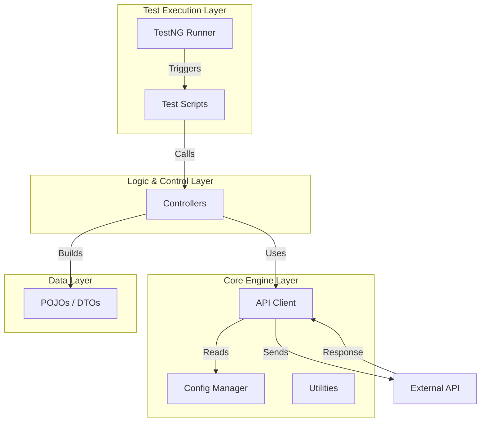
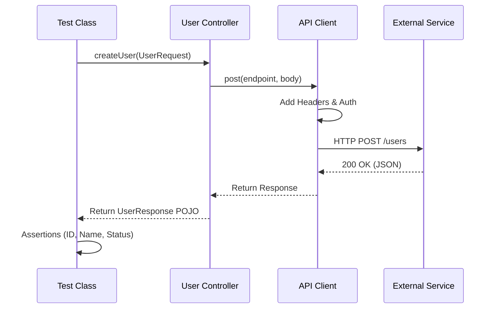

# 🚀 Modular API Automation Framework

<p align="center">
  
</p>

<p align="center">
  
  
  
  
  
</p>

---

## 🌟 Overview

Welcome to the **Modular API Automation Framework** — a **production-ready**, high-performance testing solution designed for scalability and speed. Built with **Java 17** and **RestAssured**, this framework completely decouples validation logic from test data, ensuring that your tests are as readable as they are robust.

Whether you're running locally, in Docker, or via CI/CD pipelines, this framework executes seamlessly, providing instant feedback through rich **Allure Reports**.

---

## 🎨 Stellar Features

*   **🧩 Layered Architecture**: strict separation of concerns (Client, Controller, DTO, Test layers).
*   **⚡ Parallel Execution**: Built on **TestNG** to run methods and classes concurrently for maximum speed.
*   **📊 Type-Safe DTOs**: Uses **Lombok** and **Jackson** to map JSON payloads to Java Objects automatically.
*   **🌍 Multi-Environment**: Switch between QA, DEV, and PROD with a single config flag `-Denv`.
*   **🐳 Dockerized**: Zero-setup execution using the included Dockerfile.
*   **🔔 Real-Time Alerts**: Integrated **Telegram Notifications** for CI pipeline status updates.
*   **📝 Beautiful Reporting**: Interactive **Allure** dashboards with logs, request bodies, and pass/fail trends.

---

## 🛠️ Performance Tech Stack

| Technology | Role | Description |
| :--- | :--- | :--- |
| **Java 17** | Core Language | Robust, typed, and object-oriented foundation. |
| **RestAssured** | API Client | DSL for cleaner, powerful HTTP requests (BDD style). |
| **TestNG** | Test Runner | Handles assertions, parallel execution, and suites. |
| **Jackson** | Json Processor | High-performance serialization/deserialization. |
| **Lombok** | Code Cleaner | Eliminates boilerplate (getters, setters, builders). |
| **Allure** | Reporting | Visualizes test results with rich metadata. |
| **Gradle** | Build Tool | Fast, incremental builds and dependency management. |
| **GitHub Actions** | CI/CD | Automates testing on every push/PR. |

---

## 🏗️ Core Architecture & Design Patterns

We use a **Low Level Design (LLD)** focused on modularity to ensure the framework stays maintainable as it scales.

### 🏛 High-Level Design (HLD)



### 🧠 Low-Level Design (LLD) - Execution Flow



### 🧩 Design Patterns Implementation
*   **Builder Pattern**: Used in DTOs (`UserRequest.builder().name("Neo").build()`) for clear object construction.
*   **Singleton Pattern**: Ensures `EnvironmentConfig` is loaded once and accessible globally.
*   **Facade Pattern**: Controllers act as a facade, hiding the complexity of HTTP calls from the tests.
*   **POJO Integration**: strict mapping of JSON <-> Java Objects to avoid string manipulation.

---

## 📂 Project Structure

```text
modular-api-automation-framework
├── .github/workflows     # 🤖 CI/CD Pipelines (Docker, API Tests)
├── assets/               # 🖼️ Brand assets & Hero images
├── src/main/java
│   └── com.abhinav
│       ├── client        # 🔌 Wraps RestAssured (Get, Post, Put)
│       ├── config        # ⚙️ Env variables (QA/DEV/PROD)
│       ├── controller    # 🎮 Business Logic & Endpoints
│       ├── dto           # 📦 POJOs (Request/Response Objects)
│       └── utils         # 🛠 Helpers (Faker, String manip)
├── src/test/java         # 🧪 Test Scripts (Validation Layer)
├── Dockerfile            # 🐳 Container configuration
├── build.gradle          # 🐘 Dependencies & Plugins
└── testng.xml            # 🚦 Test Suite Configuration
```

---

## 🏃‍♂️ Getting Started

### 1️⃣ Prerequisites
*   Java JDK 17+
*   Docker (Recommended)

### 2️⃣ Running Tests
```bash
# Run all tests in default environment
./gradlew clean test

# Run tests in specific environment (qa, dev, prod)
./gradlew clean test -Denv=qa
```

### 3️⃣ Docker Support
```bash
# Build & Run with Docker
docker build -t api-tests .
docker run --rm api-tests
```

### 4️⃣ Reporting
```bash
# Generate and open Allure report
./gradlew allureServe
```

---

## 🤖 CI/CD & DevOps Integration

Our pipeline is automated via **GitHub Actions** for every push and Pull Request.

*   **Automation**: Runs the full suite on every commit.
*   **Reports**: Automatically deploys Allure Reports to **GitHub Pages**.
*   **Notifications**: Instant **Telegram Alerts** with build status and report links.

---

## 🔮 Roadmap & Evolution

We are constantly evolving! Here are the next milestones for this framework:

*   [ ] **🤝 Contract Testing**: Integrating **Pact** for consumer-driven contract (CDC) validation.
*   [ ] **🧠 AI Self-Healing via Gemini**: Utilizing **Google Gemini AI** to automatically analyze and suggest fixes for failed tests.
*   [ ] **📊 Enhanced Data-Driven**: Adding support for **CSV/Excel** data injection for bulk scenario testing.
*   [ ] **🛡️ Security Layer**: Basic security scanning (OWASP ZAP) integration for API vulnerability checks.
*   [ ] **⚡ Performance Injection**: Lightweight load testing using **k6** directly within the CI pipeline.

---

## 👨‍💻 Author

Created with ❤️ by **Abhinav**  
🔗 **[GitHub Profile](https://github.com/abhi9avx)**

---
*If you find this useful, don't forget to ⭐ the repository!*
