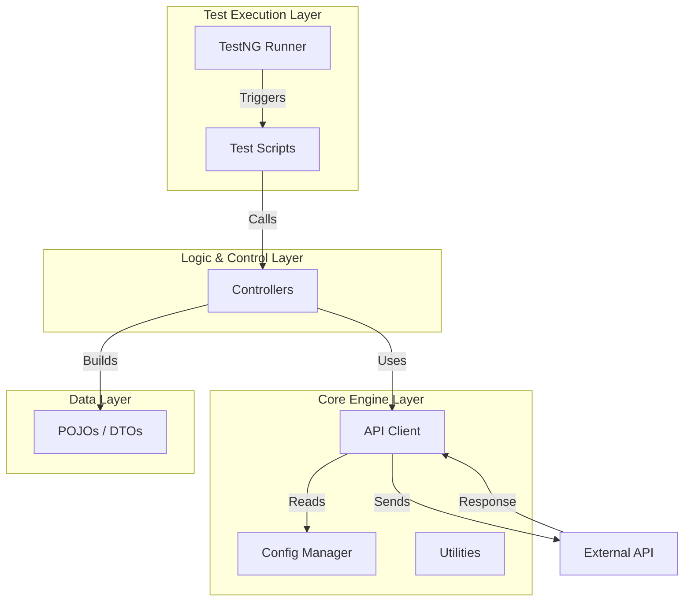
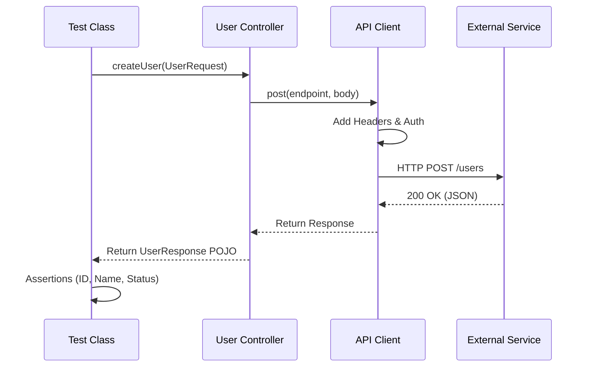

# 🚀 Modular API Automation Framework

<p align="center">
  
  
  
  
  
</p>

---

## 🌟 Overview

Welcome to the **Modular API Automation Framework** — a **production-ready**, high-performance testing solution designed for scalability and speed. Built with **Java 17** and **RestAssured**, this framework completely decouples validation logic from test data, ensuring that your tests are as readable as they are robust.

Whether you're running locally, in Docker, or via CI/CD pipelines, this framework executes seamlessly, providing instant feedback through rich **Allure Reports**.

---

## 🎨 Stellar Features

*   **🧩 Layered Architecture**: strict separation of concerns (Client, Controller, DTO, Test layers).
*   **⚡ Parallel Execution**: Built on **TestNG** to run methods and classes concurrently for maximum speed.
*   **📊 Type-Safe DTOs**: Uses **Lombok** and **Jackson** to map JSON payloads to Java Objects automatically.
*   **🌍 Multi-Environment**: Switch between QA, DEV, and PROD with a single config flag `-Denv`.
*   **🐳 Dockerized**: Zero-setup execution using the included Dockerfile.
*   **🔔 Real-Time Alerts**: Integrated **Telegram Notifications** for CI pipeline status updates.
*   **📝 Beautiful Reporting**: Interactive **Allure** dashboards with logs, request bodies, and pass/fail trends.

---

## 🛠️ Performance Tech Stack

| Technology | Role | Description |
| :--- | :--- | :--- |
| **Java 17** | Core Language | Robust, typed, and object-oriented foundation. |
| **RestAssured** | API Client | DSL for cleaner, powerful HTTP requests (BDD style). |
| **TestNG** | Test Runner | Handles assertions, parallel execution, and suites. |
| **Jackson** | Json Processor | High-performance serialization/deserialization. |
| **Lombok** | Code Cleaner | Eliminates boilerplate (getters, setters, builders). |
| **Allure** | Reporting | Visualizes test results with rich metadata. |
| **Gradle** | Build Tool | Fast, incremental builds and dependency management. |
| **GitHub Actions** | CI/CD | Automates testing on every push/PR. |

---

## 🏗️ Core Architecture & Design Patterns

We use a **Low Level Design (LLD)** focused on modularity to ensure the framework stays maintainable as it scales.

### 🏛 High-Level Design (HLD)



### 🧠 Low-Level Design (LLD) - Execution Flow



### 🧩 Design Patterns Implementation
*   **Builder Pattern**: Used in DTOs (`UserRequest.builder().name("Neo").build()`) for clear object construction.
*   **Singleton Pattern**: Ensures `EnvironmentConfig` is loaded once and accessible globally.
*   **Facade Pattern**: Controllers act as a facade, hiding the complexity of HTTP calls from the tests.
*   **POJO Integration**: strict mapping of JSON <-> Java Objects to avoid string manipulation.

---

## 📂 Project Visual Map

```text
modular-api-automation-framework
├── .github/workflows     # 🤖 CI/CD Pipelines (Docker, API Tests)
├── src/main/java
│   └── com.abhinav
│       ├── client        # 🔌 Wraps RestAssured (Get, Post, Put)
│       ├── config        # ⚙️ Env variables (QA/DEV/PROD)
│       ├── controller    # 🎮 Business Logic & Endpoints
│       ├── dto           # 📦 POJOs (Request/Response Objects)
│       └── utils         # 🛠 Helpers (Faker, String manip)
├── src/test/java         # 🧪 Test Scripts (Validation Layer)
├── Dockerfile            # 🐳 Container configuration
├── build.gradle          # 🐘 Dependencies & Plugins
└── testng.xml            # 🚦 Test Suite Configuration
```

---

## 🏃‍♂️ How to Run & Use

### 1️⃣ Prerequisites
*   Java JDK 17+
*   Docker (Optional)

### 2️⃣ Quick Start
Clone the repo and run the tests:
```bash
# Run all tests
./gradlew clean test

# Run specific environment
./gradlew clean test -Denv=qa
```

### 3️⃣ Run with Docker
Isolate your environment and run anywhere:
```bash
docker build -t api-tests .
docker run --rm api-tests
```

### 4️⃣ Generate Reports
View the results in a browser:
```bash
./gradlew allureServe
```

---

## 🤖 CI/CD Evolution (GitHub Actions)

We automate our testing lifecycle using **GitHub Actions**.

### 🔄 Pipelines
1.  **API Automation**: Triggers on push. Runs tests, generates Allure report, and deploys to GitHub Pages.
2.  **Docker Validation**: Builds and runs the container to ensure portability.

### 🔔 Notifications
The pipeline sends a **Telegram Message** on completion with:
*   ✅ Build Status (Success/Failure)
*   🔗 Link to the Allure Report
*   ⏱ Execution Time

*(Configure `TELEGRAM_BOT_TOKEN` and `TELEGRAM_CHAT_ID` in repo settings to enable)*

---

## 🔮 Roadmap & Upcoming Features

We are constantly improving! Here is what's coming next:
*   [ ] **GraphQL Support**: Native testing support for GraphQL endpoints.
*   [ ] **Contract Testing**: Integration with Pact for consumer-driven contracts.
*   [ ] **Kubernetes Support**: Helm charts for deploying test runners in K8s clusters.
*   [ ] **Performance Testing**: Gatling/JMeter integration for load testing.

---

## 🤝 How to Fork & Contribute

We welcome contributions! If you want to improve this framework:

1.  **Fork the Repository**: Click the `Fork` button at the top right of this page.
2.  **Clone Your Fork**:
    ```bash
    git clone https://github.com/abhi9avx/modular-api-automation-framework.git
    ```
3.  **Create a Branch**:
    ```bash
    git checkout -b feature/my-new-feature
    ```
4.  **Make Changes & Commit**:
    ```bash
    git commit -m "Add some amazing feature"
    ```
5.  **Push to GitHub**:
    ```bash
    git push origin feature/my-new-feature
    ```
6.  **Open a Pull Request**: Go to the original repository and create a Pull Request.

---

## 👨‍💻 Author

Created and maintained by **Abhinav**  
🔗 **[GitHub Profile](https://github.com/abhi9avx)**

Made with ❤️ for the SDET/QA Community.


