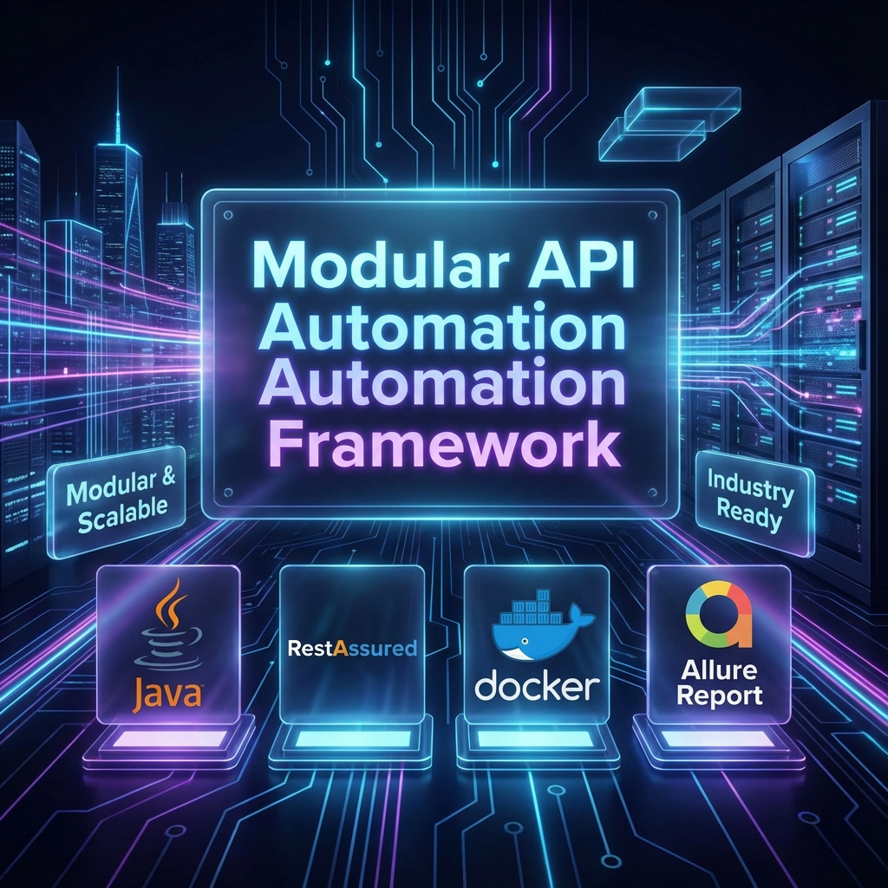
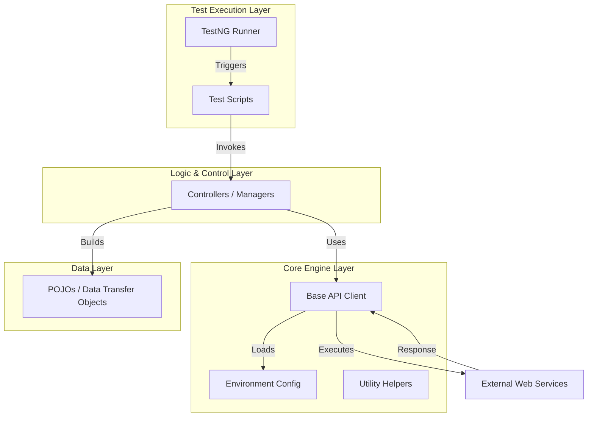
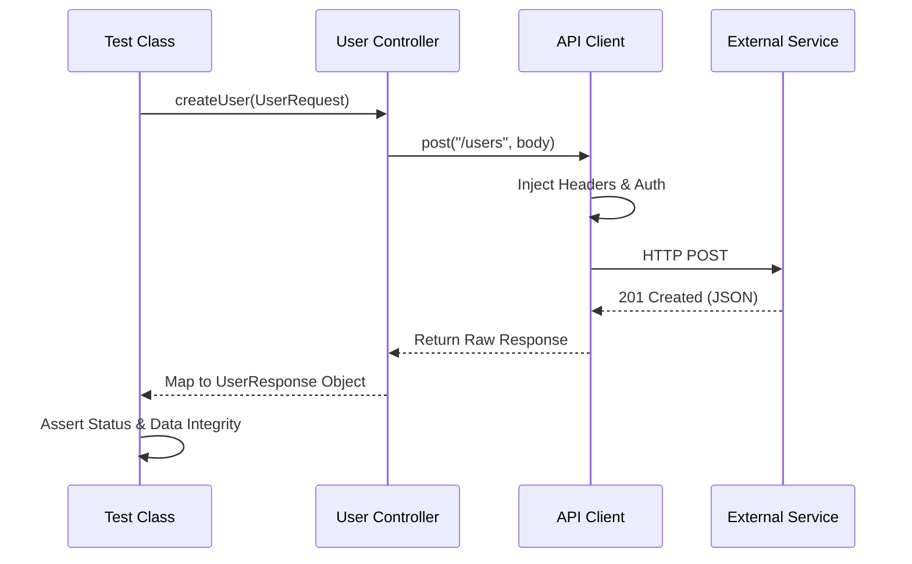

# 🚀 Modular API Automation Framework

<p align="center">
  
</p>

<p align="center">
  
  
  
  
  
</p>

---

## 🌟 Overview

The **Modular API Automation Framework** is a **production-ready**, high-performance testing solution designed for enterprise-grade scalability and speed. Built with **Java 17** and **RestAssured**, it employs a strict separation of concerns to ensure that tests remain readable, maintainable, and robust as the system grows.

Whether executing locally for development, within isolated **Docker** containers, or as part of a **CI/CD pipeline**, this framework provides comprehensive feedback through rich, interactive **Allure Reports**.

---

## 🎨 Stellar Features

*   **🧩 Layered Architecture**: Strict decoupling of Client, Controller, DTO, and Test layers.
*   **⚡ Parallel Execution**: Optimized via **TestNG** to run suites and methods concurrently.
*   **📊 Type-Safe DTOs**: Automated JSON mapping using **Lombok** and **Jackson**.
*   **🌍 Multi-Environment Management**: Switch contexts (QA, DEV, PROD) instantly via the `-Denv` flag.
*   **🐳 Containerized Workflow**: Zero-setup execution with a fully optimized Dockerfile.
*   **🔔 Intelligent Alerts**: Real-time **Telegram** notifications for pipeline build status.
*   **📝 Professional Reporting**: Interactive dashboards with request/response logs and trend analysis.

---

## 🛠️ Performance Tech Stack

| Technology | Role | Why We Use It? |
| :--- | :--- | :--- |
| **Java 17** | Core Engine | Long-term support, performance, and type safety. |
| **RestAssured** | API Client | Fluent, human-readable DSL for complex HTTP assertions. |
| **TestNG** | Test Runner | Superior parallel execution and flexible test configuration. |
| **Jackson** | JSON Processor | The industry standard for high-performance serialization. |
| **Lombok** | Boilerplate Killer | Keeps DTOs clean by automating getters, setters, and builders. |
| **Allure** | Reporting | Provides executive-level visual insights into test health. |
| **Gradle** | Build Tool | Fast incremental builds and modern dependency management. |
| **GitHub Actions** | CI/CD | Seamless automation of the testing lifecycle. |

---

## �️ Core Architecture & Design Patterns

The framework is designed using **Low-Level Design (LLD)** principles to ensure maximum modularity and reusability.

### 🏛 High-Level Design (HLD)



### 🧠 Low-Level Design (LLD) - Execution Flow



### 🧩 Design Patterns Implemented
*   **Facade Pattern**: Controllers hide the complexity of HTTP handling from the test scripts.
*   **Singleton Pattern**: Manages a single instance of `EnvironmentConfig` across the framework.
*   **Builder Pattern**: Utilized in DTOs for readable and concise object creation.
*   **Factory Pattern**: Dynamically creates request specifications based on the environment.

---

## 📂 Project Structure Map

```text
modular-api-automation-framework
├── .github/workflows     # 🤖 CI/CD Pipelines (Automated Testing & Deployment)
├── assets/               # 🖼️ High-res brand assets and project visuals
├── src/main/java
│   └── com.abhinav
│       ├── client        # 🔌 Core RestAssured wrapper
│       ├── config        # ⚙️ Environment and Global properties
│       ├── controller    # 🎮 Business logic & endpoint abstractions
│       ├── dto           # 📦 Type-safe Request/Response objects
│       └── utils         # 🛠 Utilities (Fakers, Logging, Parsers)
├── src/test/java         # 🧪 Test suites and validation logic
├── Dockerfile            # 🐳 Containerization config
├── build.gradle          # 🐘 Build configuration and dependencies
└── testng.xml            # 🚦 Test execution suites
```

---

## 🏃‍♂️ Setup & Execution

### 1️⃣ Prerequisites
- **Java JDK 17** or higher.
- **Gradle 8.x** (Included in wrapper).
- **Docker** (Optional, for containerized runs).

### 2️⃣ Running Tests Locally
```bash
# Execute all tests in the default environment
./gradlew clean test

# Execute tests in a specific environment
./gradlew clean test -Denv=qa
```

### 3️⃣ Docker Execution
```bash
# Build the image
docker build -t api-framework .

# Run the suite in a container
docker run --rm api-framework
```

### 4️⃣ Visualizing Results
```bash
# Generate and serve Allure reports
./gradlew allureServe
```

---

## 🤖 CI/CD Integration (GitHub Actions)

The framework is fully integrated into **GitHub Actions** to automate the Quality Assurance lifecycle.

*   **Continuous Testing**: Automatically triggered on every `push` and `pull_request`.
*   **Artifact Deployment**: Test reports are automatically generated and hosted on **GitHub Pages**.
*   **Real-time Feedback**: Integrates with **Telegram Bot API** to send instant success/failure notifications to the engineering team, including a direct link to the Allure report.

---

## 🤝 Contribution & Forking

We welcome contributions! If you'd like to enhance this framework:
1. **Fork** the repository.
2. Create a **Feature Branch** (`git checkout -b feature/AmazingFeature`).
3. **Commit** your changes (`git commit -m 'Add some AmazingFeature'`).
4. **Push** to the branch (`git push origin feature/AmazingFeature`).
5. Open a **Pull Request**.

---

## 🔮 Roadmap & Evolution

We are constantly evolving! Here are the next milestones for this framework:

*   [ ] **🤝 Contract Testing**: Integrating **Pact** for consumer-driven contract (CDC) validation.
*   [ ] **🧠 AI Self-Healing via Gemini**: Utilizing **Google Gemini AI** to automatically analyze and suggest fixes for failed tests.
*   [ ] **📊 Enhanced Data-Driven**: Adding support for **CSV/Excel** data injection for bulk scenario testing.
*   [ ] **🛡️ Security Layer**: Basic security scanning (OWASP ZAP) integration for API vulnerability checks.
*   [ ] **⚡ Performance Injection**: Lightweight load testing using **k6** directly within the CI pipeline.

---

## 👨‍💻 Author

Developed and maintained by **Abhinav**  
🔗 **[GitHub Profile](https://github.com/abhi9avx)**

*Made with ❤️ for the SDET community. Please give a ⭐ if you find this project helpful!*
